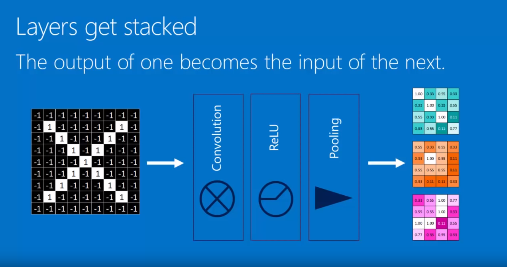

labelki:

```json
{
  "papier": [1, 0, 0, 0, 0],  - niebieski
  "plastikAlm": [0, 1, 0, 0, 0], - żółte
  "szkło": [0, 0, 1, 0, 0], - zielone
  "bio": [0, 0, 0, 1, 0], - brązowe
  "mix": [0, 0, 0, 0, 1], - czarne
},
```


Wykorzystałem zmodyfikowaną wersję sieci AlexNet.

<!-- TUTAJ DAC SCREEN
http://alexlenail.me/NN-SVG/index.html -->


Przygotowanie zdjęć:
 - [Pobieranie z uzyciem biblioteki](https://github.com/hardikvasa/google-images-download)
 - [Przygotowanie zdjęć pod ML](https://github.com/mdbloice/Augmentor)
 - [Przygotowanie zdjęcia pod predykowanie z użyciem ML - imageMagic](https://www.imagemagick.org/Usage/resize/)
 - `convert NAZWA -resize 50x50! NAZWA_PO_RESIZE`


